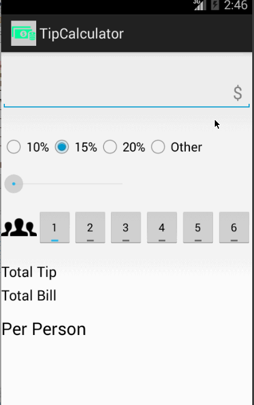

# Tip-Calculator
==============

A tip calculator utility app which allows a user to calculate the appropriate tip based on the total amount entered.

This is an Android application for calculating tip. 

 [Crouton](https://github.com/keyboardsurfer/Crouton). 

Time spent: ~25 hours spent in total

User is displayed the tip of specified percentage for specified entered amount
User enters the total amount of the transaction
User can select between tip amounts (i.e 10%, 15%, 20%)
Upon selecting tip amount, formatted tip value is displayed
Optional: User changes the total amount and updated tip is reflected automatically
Optional: User can select custom tip percentage if desired
Optional: User can select how many ways to split the tip
Optional: User can edit preset tip percentages and have them persist across launches
Optional: Experiment with trying input widgets to replace the buttons and/or textviews
Optional: Improve the user interface and experience by using images and/or colors

Completed user stories:

 * [x] Required: User is displayed the tip of specified percentage for specified entered amount
 * [x] Required: User enters the total amount of the transaction
 * [x] Required: User can select between tip amounts (i.e 10%, 15%, 20%)
 * [x] Required: Upon selecting tip amount, formatted tip value is displayed
 
 * [x] Optional: User changes the total amount and updated tip is reflected automatically
 * [x] Optional: User can select how many ways to split the tip
 * [x] Optional: Improve the user interface and experience by using images and/or colors
 ** Use [Crouton](https://github.com/keyboardsurfer/Crouton) instead of Toast for user error warning
 ** Show keyboard when activity starts and replace "Next" key with "Done"

Notes:

Also try out other optional features but didn't complete.  They can be seen in branches sample1 to sample9; sample6 is same as master.

Walkthrough of all user stories:

GIF created with [LiceCap](http://www.cockos.com/licecap/).

